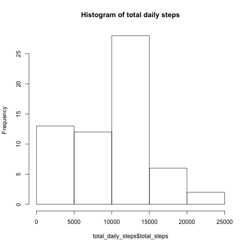
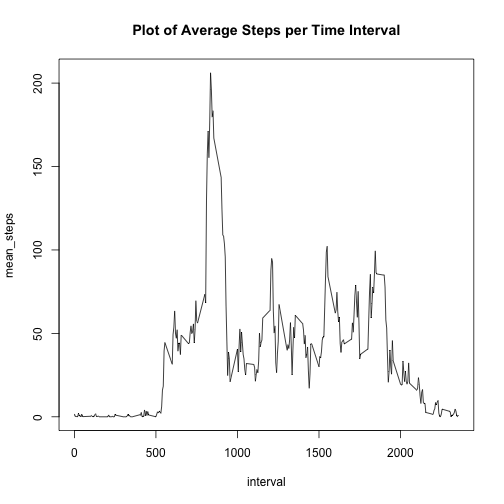
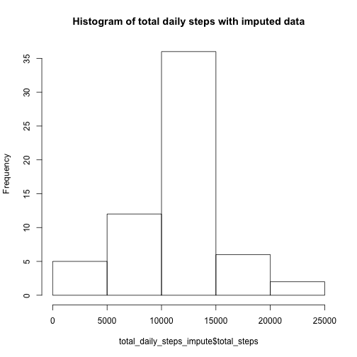
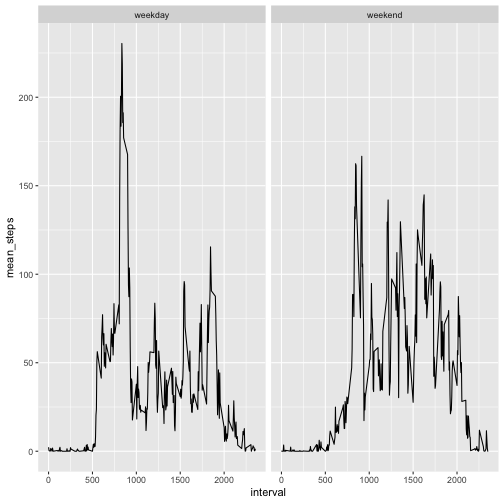

```r
library(lubridate)
library(ggplot2)
library(dplyr)
```

## Loading and preprocessing the data

Loading data.  Set cache=TRUE so only runs once.

```r
df <- read.csv("activity.csv",stringsAsFactors = F)
head(df)
```

```
##   steps       date interval
## 1    NA 2012-10-01        0
## 2    NA 2012-10-01        5
## 3    NA 2012-10-01       10
## 4    NA 2012-10-01       15
## 5    NA 2012-10-01       20
## 6    NA 2012-10-01       25
```

```r
summary(df)
```

```
##      steps            date              interval     
##  Min.   :  0.00   Length:17568       Min.   :   0.0  
##  1st Qu.:  0.00   Class :character   1st Qu.: 588.8  
##  Median :  0.00   Mode  :character   Median :1177.5  
##  Mean   : 37.38                      Mean   :1177.5  
##  3rd Qu.: 12.00                      3rd Qu.:1766.2  
##  Max.   :806.00                      Max.   :2355.0  
##  NA's   :2304
```

Reformatting date variable

```r
df$date <- ymd(df$date)
class(df$date)
```

```
## [1] "Date"
```

## What is mean total number of steps taken per day?

Checking mean number of steps per day, ignoring missing values

```r
total_daily_steps <- df %>%
      group_by(date) %>%
      summarize(total_steps = sum(steps,na.rm=T))
hist(total_daily_steps$total_steps,main="Histogram of total daily steps")
```



```r
mean_total_daily_steps <- 
      round(mean(total_daily_steps$total_steps),2)
median_total_daily_steps <- 
      round(median(total_daily_steps$total_steps),2)
```
The mean total daily steps is 9354.23 and the median is 1.0395 &times; 10<sup>4</sup>.

## What is the average daily activity pattern?
Checking how average step counts change by 5 minute interval

```r
mean_interval_steps <- df %>%
      group_by(interval) %>%
      summarize(mean_steps = mean(steps,na.rm=T))
with(mean_interval_steps, plot(interval,mean_steps,
                              type="l",
                              main="Plot of Average Steps per Time Interval"))
```



```r
max_interval <- mean_interval_steps[mean_interval_steps$mean_steps==max(mean_interval_steps$mean_steps),]
```
The interval with the most steps is 835 with an average of 206.1698113. steps.

Checking for NA's.  I already know from my summary check above that the steps variable is the only one with any missing values.

```r
length(df$steps[is.na(df)])
```

```
## [1] 2304
```
## Imputing missing values
I'm going to fill in the missing values with the mean steps from the corresponding time interval. 


```r
df_impute <- merge(df,mean_interval_steps,all.x=T) %>%
      mutate(steps = ifelse(is.na(steps),mean_steps,steps)) %>%
      select(steps,date,interval)
length(df_impute$steps[is.na(df_impute)])
```

```
## [1] 0
```

Creating histogram of the total steps taken per day with the imputed dataset

```r
total_daily_steps_impute <- df_impute %>%
      group_by(date) %>%
      summarize(total_steps = sum(steps))
hist(total_daily_steps_impute$total_steps,
     main="Histogram of total daily steps with imputed data")
```



```r
mean_total_daily_steps_impute <- 
      round(mean(total_daily_steps_impute$total_steps),2)
median_total_daily_steps_impute <- 
      round(median(total_daily_steps_impute$total_steps),2)
```
The mean total daily steps in the imputed data is 1.076619 &times; 10<sup>4</sup> and the median is 1.076619 &times; 10<sup>4</sup> compared to 9354.23 and 1.0395 &times; 10<sup>4</sup> from the original data.  Imputing the missing values results in larger mean and median estimates of total daily steps. 

## Are there differences in activity patterns between weekdays and weekends?

Next we'll see if there is a difference in behavior between weekdays and weekends.


```r
# Creating factor variable to indicate weekend/weekday type
df_impute$day <- weekdays(df_impute$date)
weekend_days <- c('Saturday','Sunday')
df_impute$day_type <- as.factor(ifelse(df_impute$day %in% weekend_days,
                                       'weekend',
                                       'weekday'))
head(df_impute)
```

```
##      steps       date interval      day day_type
## 1 1.716981 2012-10-01        0   Monday  weekday
## 2 0.000000 2012-11-23        0   Friday  weekday
## 3 0.000000 2012-10-28        0   Sunday  weekend
## 4 0.000000 2012-11-06        0  Tuesday  weekday
## 5 0.000000 2012-11-24        0 Saturday  weekend
## 6 0.000000 2012-11-15        0 Thursday  weekday
```

Make a panel plot containing a time series plot (i.e. \color{red}{\verb|type = "l"|}type="l") of the 5-minute interval (x-axis) and the average number of steps taken, averaged across all weekday days or weekend days (y-axis). See the README file in the GitHub repository to see an example of what this plot should look like using simulated data.

Seeing how average steps taken by time interval differs between weekends and weekdays.

```r
mean_interval_steps_impute <- df_impute %>%
      group_by(day_type,interval) %>%
      summarize(mean_steps = mean(steps,na.rm=T))
head(mean_interval_steps)
```

```
## # A tibble: 6 x 2
##   interval mean_steps
##      <int>      <dbl>
## 1        0     1.72  
## 2        5     0.340 
## 3       10     0.132 
## 4       15     0.151 
## 5       20     0.0755
## 6       25     2.09
```

```r
ggplot(mean_interval_steps_impute, aes(x=interval,y=mean_steps)) +
      geom_line()+
      facet_wrap(~ day_type)
```



Yes, there are differences.  The steps during the weekday are mostly taken at a single time whereas during the weekend they are spread more across the day. 
Next I ran the following code from the console. 

      >cd /users/amywhite/desktop/reproducible-research/PeerAssessment1
      >R 
      >library(knitr)
      >knit2html("PA1_template.Rmd", force_v1 = TRUE)

This created an html file that could actually be opened in a browser as well as a folder called 'figures' that contained the images that were part of the html.
